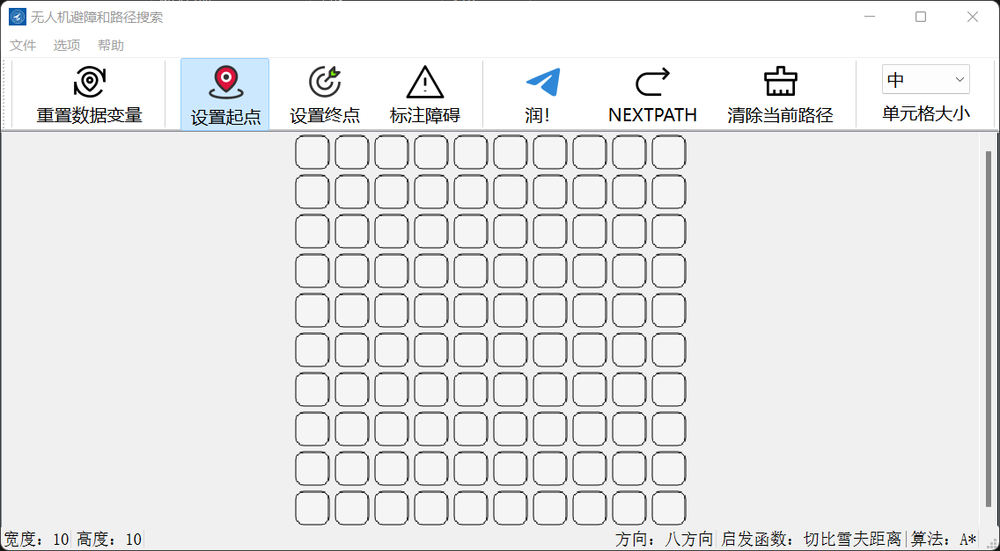

# A-star

## 算法演示：无人机路径搜索和优化

## 目录

[运行界面](#运行界面)

[安装](#安装)

[功能介绍](#功能介绍)

[演示](#演示)

## 运行界面



## 安装 

```
git clone git@github.com:LJJbyZJU/A-star.git
```

## 功能介绍

### 界面

```
1. 自定义地图宽高
2. 地图单元格大小可调
3. 自定义起点、终点、障碍物
4. 底部状态栏，便于调试
5. 顶部工具栏可隐藏
6. 显示最优路径的同时将探索点用不同颜色显示在地图中
7. 绘制地图可以 .Amap 文件保存到本地文件夹
8. 可将保存的 .Amap 文件载入地图
9. 可导入本地图片作为地图背景，一种伪栅格化操作
10. “关于我们”
```

### 算法

```
1. 深度优先搜索
2. 广度优先搜索
3. 传统 A 星
4. 优化 A 星
   1. 三种距离计算定义预估距离 h
      1. 切比雪夫距离
      2. 曼哈顿距离
      3. 欧几里得距离
   2. 整体动态加权 dynamic
   3. 自定义拐角权值 penalty
   4. 自定义安全距离模式 alpha
```

## 演示


