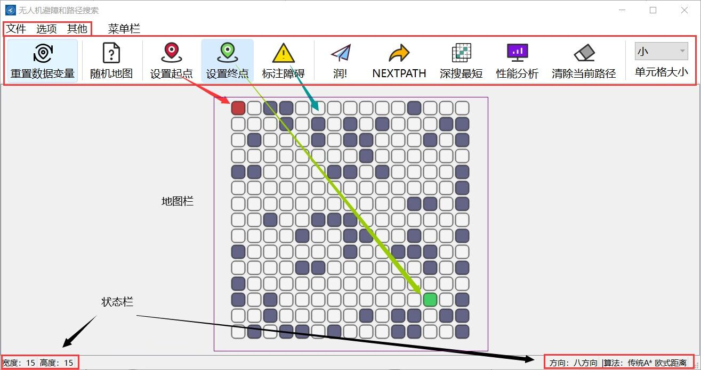

# A-star

## 算法演示：无人机路径搜索和优化

## 目录

[运行界面](#运行界面)

[安装与打包](#安装与打包)

[功能介绍](#功能介绍)

[演示](#部分演示)

[其他说明](#其他说明)

## 运行界面



## 安装与打包

本项目基于 QT 框架使用 C++ 开发

开发环境：Windows

```
git clone git@github.com:LJJbyZJU/A-star.git
```

建议安装 QT creator 打开 Astar.pro 文件即可编辑

我使用的是 Enigma Virtual Box 打包，可以[参考这篇博客](https://blog.csdn.net/qq_40994692/article/details/113880198)

## 功能介绍

### 界面

```
1. 自定义地图宽高
2. 地图单元格大小可调
3. 自定义起点、终点、障碍物
4. 底部状态栏，便于调试
5. 顶部工具栏可隐藏
6. 显示最优路径的同时将探索点用不同颜色显示在地图中
7. 绘制地图可以 .Amap 文件保存到本地文件夹
8. 可将保存的 .Amap 文件载入地图
9. 性能分析，数据可视化处理
10. 生成随机地图（生成逻辑待优化，目前还不能确保生成的地图一定存在可行路径）
11. 可导入本地图片作为地图背景，一种伪栅格化操作
12. “关于我们”页面
13. 一点拙劣的 QSS 美化
```

### 算法

```
1. 深度优先搜索算法
2. 广度优先搜索算法
3. Dijkstra 算法
4. 最佳优先搜索算法
5. 传统 A 星算法
6. 双向 A 星算法
7. 优化 A 星算法
   - 三种距离计算定义预估距离 h
      - 切比雪夫距离
      - 曼哈顿距离
      - 欧几里得距离
   - 整体动态加权 dynamic
   - 自定义拐角权值 penalty
   - 自定义安全距离模式 alpha
8. 三种增量式搜索算法（还不够完善，不建议使用）
```

## 部分演示

- 自定义地图参数

本项目可以自由设置地图的长宽，单元格有四种状态选择：

[设置地图](./RDME_IMG/Astar_gif/设置地图.gif)

- 优化Astar算法

其中一种优化A星算法的演示，且本项目支持采用**贝塞尔曲线**作为无人机路径轨迹：

[Astar算法演示](./RDME_IMG/Astar_gif/A星&贝塞尔.gif)

- 生成随机地图 & 重置地图数据

支持生成随机地图（生成逻辑比较简单，利用伪随机数生成，二次开发时可以优化这里的生成逻辑）和一键重置地图参数：

[随机地图](./RDME_IMG/Astar_gif/随机地图.gif)

- 保存地图到本地

考虑到项目的展示环节，不可能现场画地图，所以本项目支持将地图保存到本地：

[保存地图](./RDME_IMG/Astar_gif/保存地图.gif)

- 打开本地地图 & 深度优先算法演示

打开保存的.Amap文件，演示深度优先算法，按下`深搜最短`可以获得所有深搜得到路径中的最短路径（深搜实现没有问题，只是操作时需要注意，一步步来，否则容易出bug）：

[打开地图](./RDME_IMG/Astar_gif/深搜.gif)

- 导入背景图片

导入图片作为背景，描绘地图（二次开发时建议开发栅格化处理）：

[背景图片](./RDME_IMG/Astar_gif/打开&清除背景.gif)

- 其他

还有不少小细节（关于页、可视化性能分析、操作提示框、页脚状态栏、进入的淡入淡出...）：

[其他](./RDME_IMG/Astar_gif/其他.gif)

## 其他说明

项目用于学校的课设，所以一些 ico 图标都与 NWPU 相关。另外，项目制作时还是有很多不规范的地方，小细节有不少但是bug也不少，还有点史山...大家多多包涵。