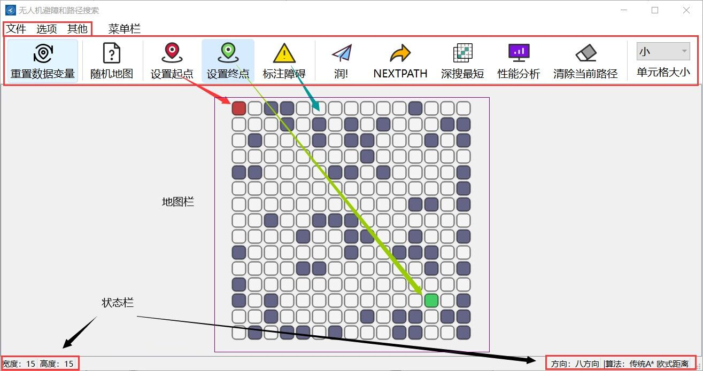
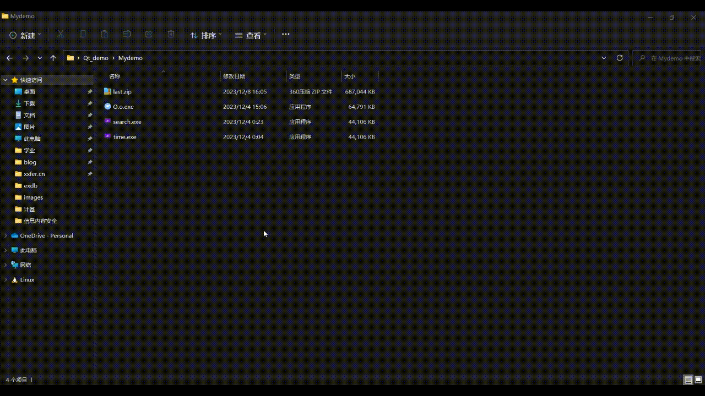
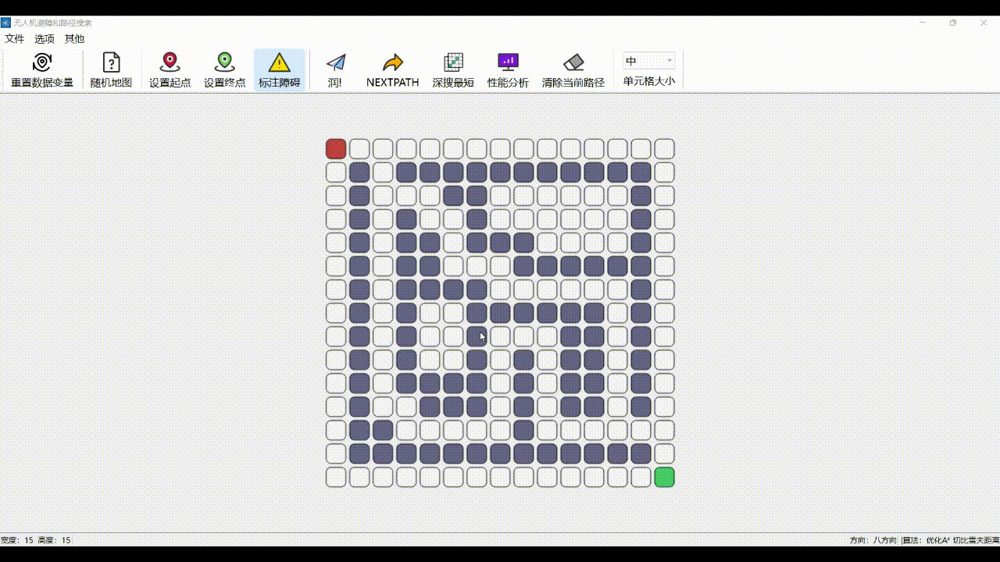
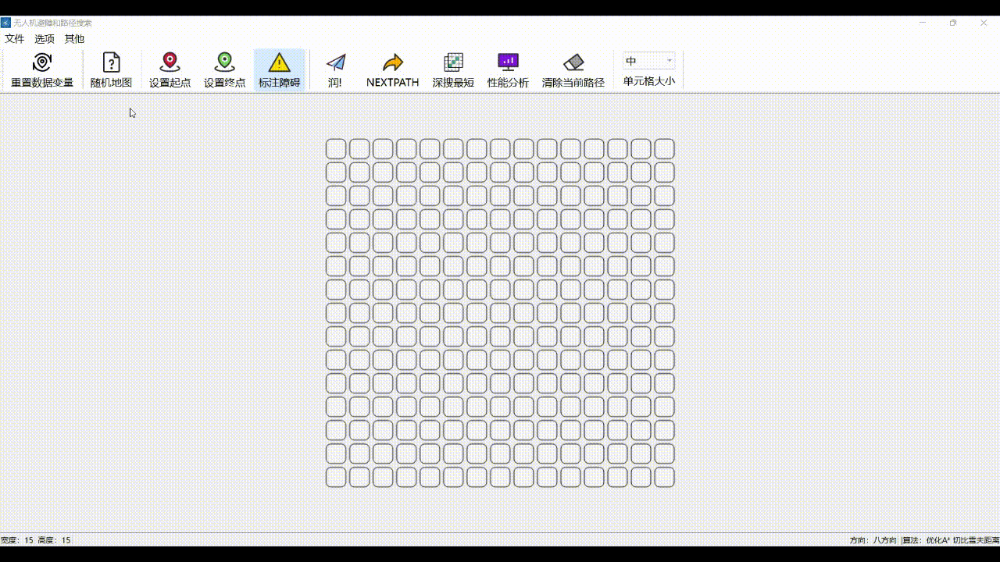
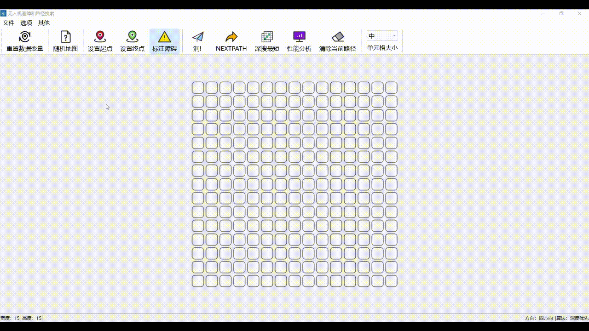

# A-star

## Algorithm Demonstration: UAV Path Search and Optimization

## README.md

- en [English](README.md)
- zh_CN [简体中文](README/README.zh_CN.md)
- zh_TW [繁体中文](README/README.zh_TW.md)
- de_DE [Deutsch](README/README.de_DE.md)

## Table of contents

[Run interface](#Interface)

[Installation and Packaging](#Installation&packaging)

[Function introduction](#Features)

[Demo](#Partial-demonstration)

[Other instructions](#Other)

## Interface



## Installation&packaging

This project is developed using C++ based on the QT framework

Development environment: Windows

```
git clone git@github.com:LJJbyZJU/A-star.git
```

It is recommended to install QT creator and open the Astar.pro file for editing.

I use Enigma Virtual Box packaging, you can [refer to this blog](https://blog.csdn.net/qq_40994692/article/details/113880198)

## Features

### Interface

```markdown
1. Customize map width and height
2. Adjustable map cell size
3. Customize starting point, end point, and obstacles
4. Bottom status bar for easy debugging
5. The top toolbar can be hidden
6. Display the optimal path while displaying exploration points in different colors on the map
7. When drawing a map, you can save the .Amap file to a local folder.
8. Saved .Amap files can be loaded into the map
9. Performance analysis, data visualization processing
10. Generate a random map (the generation logic needs to be optimized, and it is not yet guaranteed that the generated map must have a feasible path)
11. Local images can be imported as map background, a pseudo-rasterization operation
12. “About Us” page
13. A little poor QSS beautification
```

### Algorithm

```markdown
1. Depth-first search algorithm
2. Breadth-first search algorithm
3. Dijkstra’s algorithm
4. Best first search algorithm
5. Traditional A-star algorithm
6. Bidirectional A-star algorithm
7. Optimize A-star algorithm
    - Three distance calculations define estimated distance h
       - Chebyshev distance
       - Manhattan distance
       - Euclidean distance
    - Overall dynamic weighting dynamic
    - Custom corner weight penalty
    - Custom safe distance mode alpha
8. Three incremental search algorithms (not perfect enough, not recommended)
```

## Partial-demonstration

- Customize map parameters

In this project, you can freely set the length and width of the map, and the cells have four status options:



- Optimize Astar algorithm

Demonstration of one of the optimization A-star algorithms, and this project supports the use of **Bezier curve** as the UAV path trajectory:


- Generate random maps & reset map data

Supports generating random maps (the generation logic is relatively simple, using pseudo-random number generation, the generation logic here can be optimized during secondary development) and resetting map parameters with one click:


- Save map locally

Considering the presentation part of the project, it is impossible to draw the map on site, so this project supports saving the map locally:



- Open local map & depth first algorithm demonstration

Open the saved .Amap file to demonstrate the depth-first algorithm. Press `deep search for shortest` to get the shortest path among all the paths obtained by deep search. (There is no problem with the deep search implementation, but you need to pay attention to the operation step by step, otherwise it is easy to cause errors. bug):



- Import background images

Import the picture as the background and draw the map (it is recommended to develop rasterization during secondary development):



- other

There are also many small details (about page, visual performance analysis, operation prompt box, footer status bar, enter fade in and out...):


## Others

The project is used for school curriculum, so some ico icons are related to NWPU. In addition, there are still many irregularities in the project production. There are many small details but also many bugs. There is also a bit of history... Please bear with me.

## Star History

<a href="https://star-history.com/#LJJbyZJU/A-star&Date">
  <picture>
    <source media="(prefers-color-scheme: dark)" srcset="https://api.star-history.com/svg?repos=LJJbyZJU/A-star&type=Date&theme=dark" />
    <source media="(prefers-color-scheme: light)" srcset="https://api.star-history.com/svg?repos=LJJbyZJU/A-star&type=Date" />
    
  </picture>
</a>

[top](#A-star)

