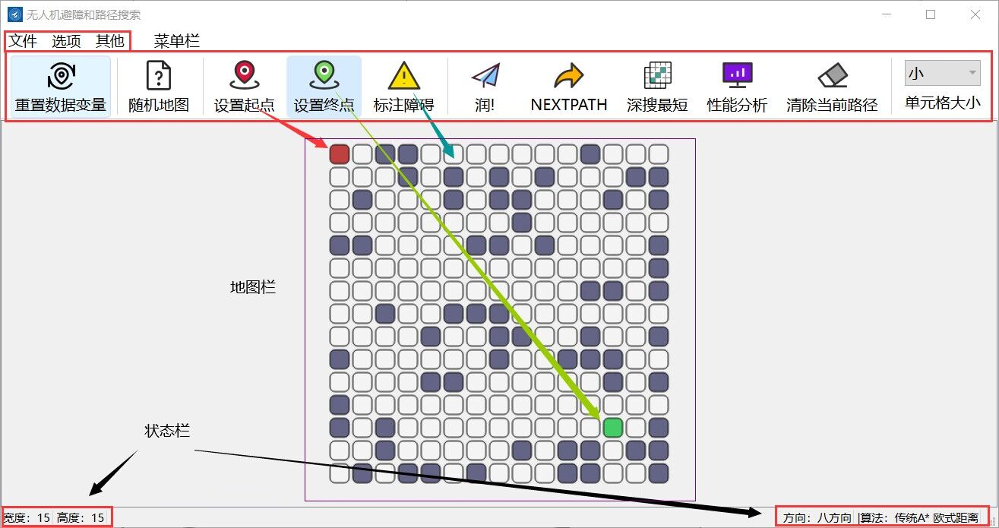

# A-Stern

## Algorithmus-Demonstration: UAV-Pfadsuche und Optimierung

## Katalog

[Laufzeitschnittstelle](#Laufende-Schnittstelle)

[Installation und Verpackung](#Installation-und-Paketierung)

[Features](#Funktionen)

[Demo](#Teilweise-Demo)

[Other Description](#Sonstige-Anmerkungen)

## Laufende-Schnittstelle



## Installation-und-Paketierung

Dieses Projekt basiert auf dem QT-Framework und wurde in C++ entwickelt.

Umgebung: Windows

```
git clone git@github.com:LJJbyZJU/A-star.git
```

Es wird empfohlen, den QT Creator zu installieren und die Datei Astar.pro zu öffnen, um sie zu bearbeiten.

Ich benutze Enigma Virtual Box Paket, Sie können [siehe diesen Blog](https://blog.csdn.net/qq_40994692/article/details/113880198)

## Funktionen

### Schnittstelle

```markdown
1. anpassbare Breite und Höhe der Karte
2. einstellbare Größe der Kartenzellen
3. anpassbarer Startpunkt, Endpunkt, Hindernisse
4. untere Statusleiste für einfache Fehlersuche
5. obere Symbolleiste kann ausgeblendet werden
6. der optimale Pfad wird angezeigt, während die Erkundungspunkte in verschiedenen Farben auf der Karte dargestellt werden.
7. die Karten können in einem lokalen Ordner als .Amap-Dateien gespeichert werden.
8 Gespeicherte .Amap-Dateien können in die Karte geladen werden.
9 Leistungsanalyse und Datenvisualisierung
10. zufällige Karten generieren (die Generierungslogik muss noch optimiert werden, es ist noch nicht möglich, sicherzustellen, dass die generierten Karten immer machbare Pfade haben).
11. Import lokaler Bilder als Kartenhintergrund, eine Pseudo-Rasterung
12. "Über uns"-Seite
13. ein wenig schlechte QSS-Verschönerung
```

### Algorithmus

```markdown
1. Tiefe-erste-Suche-Algorithmus
2. breadth-first Suchalgorithmus
3. der Dijkstra-Algorithmus
4. Best-First-Suchalgorithmus
5. traditioneller A-Star-Algorithmus
6. bidirektionaler A-Star-Algorithmus
7. optimierter A-star-Algorithmus
   - Drei Abstandsberechnungen definieren den vorhergesagten Abstand h
      - Tschebyscheff-Abstand
      - Manhattan-Abstand
      - Euklidischer Abstand
   - Dynamische Gesamtgewichtung dynamisch
   - Benutzerdefinierte Eckgewichte Strafe
   - Individuelles Modell des sicheren Abstands alpha
8. drei inkrementelle Suchalgorithmen (nicht perfekt, nicht empfohlen)
```

## Teilweise-Demo

- Benutzerdefinierte Kartenparameter

Bei diesem Projekt können Sie die Länge und Breite der Karte frei einstellen, und die Zelle hat vier Zustände, aus denen Sie wählen können:


- Optimierung des Astar-Algorithmus

Eine Demonstration eines der optimierten A-Star-Algorithmen, und dieses Projekt unterstützt die Verwendung von **Bessel-Kurven** als Drohnenflugbahn-Trajektorien:


- Zufällige Karte generieren & Kartendaten zurücksetzen

Unterstützt die Generierung einer Zufalls-Karte (die Generierungslogik ist relativ einfach und verwendet Pseudo-Zufallszahlen zur Generierung, die Sekundärentwicklung kann hier die Generierungslogik optimieren) und eine Taste zum Zurücksetzen der Kartenparameter:


- Speichern Sie die Karte lokal

In Anbetracht des Präsentationsteils des Projekts ist es nicht möglich, die Karte vor Ort zu zeichnen, daher unterstützt dieses Projekt das Speichern der Karte auf lokaler Ebene:


- Lokale Karte öffnen & Depth-first-Algorithmus-Demo

Öffnen Sie die gespeicherte .Amap-Datei, demonstrieren Sie den Depth-First-Algorithmus, drücken Sie `Deep Search Shortest`, um den kürzesten Pfad unter allen Pfaden zu ermitteln, die durch die Tiefensuche erhalten wurden (es ist kein Problem, die Tiefensuche zu implementieren, Sie müssen nur Schritt für Schritt auf die Operation achten, sonst können leicht Fehler auftreten):


- Importieren von Hintergrundbildern

Importieren Sie Bilder als Hintergrund für die Darstellung der Karte (für die Sekundärentwicklung wird eine Rasterung empfohlen):


- Sonstiges

Es gibt noch eine ganze Reihe weiterer kleiner Details (About Page, visuelle Leistungsanalyse, Action Alert Box, Footer Status Bar, Ein- und Ausblenden des Eintrags...) :


## Sonstige-Anmerkungen

Das Projekt ist für eine Schulklasseneinrichtung gedacht, daher sind einige der ico-Icons mit NWPU verbunden. Außerdem gibt es noch eine Menge Unregelmäßigkeiten in der Produktion des Projekts, es gibt eine Menge kleiner Details, aber auch eine Menge Bugs, und auch ein bisschen Shi Shan... Bitte haben Sie Geduld mit uns.

Übersetzt mit DeepL.com (kostenlose Version)