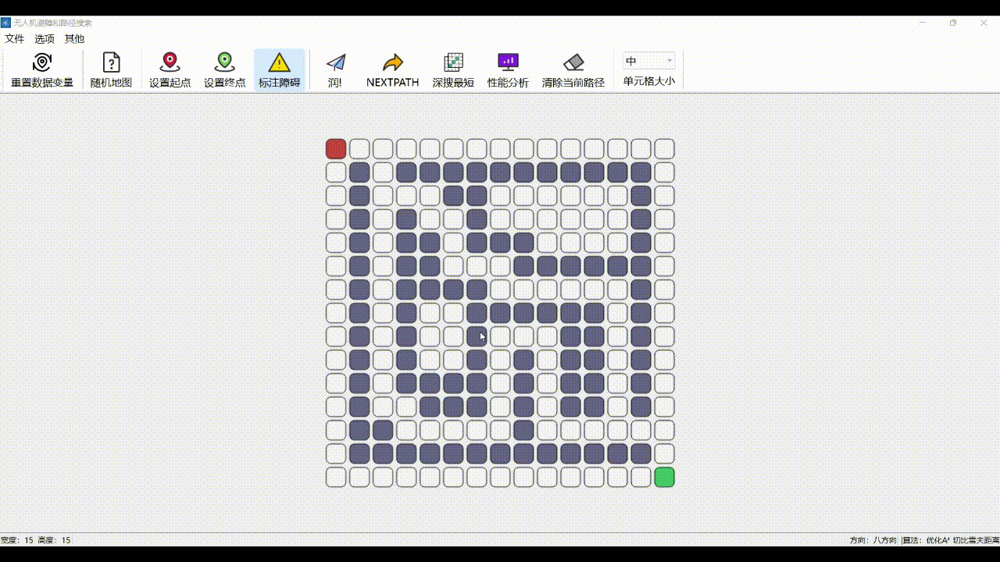

# A-star

## 算法演示：無人機路徑搜索和優化

## 目錄

[運行界面](#運行界面)

[安裝與打包](#安裝與打包)

[功能介紹](#功能介紹)

[演示](#部分演示)

[其他說明](#其他說明)

## 運行界面


## 安裝與打包

本項目基於 QT 框架使用 C++ 開發

開發環境：Windows

```
git clone git@github.com:LJJbyZJU/A-star.git
```

建議安裝 QT creator 打開 Astar.pro 文件即可編輯

我使用的是 Enigma Virtual Box 打包，可以[參考這篇博客](https://blog.csdn.net/qq_40994692/article/details/113880198)

## 功能介紹

### 界面

```
1. 自定義地圖寬高
2. 地圖單元格大小可調
3. 自定義起點、終點、障礙物
4. 底部狀態欄，便於調試
5. 頂部工具欄可隱藏
6. 顯示最優路徑的同時將探索點用不同顏色顯示在地圖中
7. 繪製地圖可以 .Amap 文件保存到本地文件夾
8. 可將保存的 .Amap 文件載入地圖
9. 性能分析，數據可視化處理
10. 生成隨機地圖（生成邏輯待優化，目前還不能確保生成的地圖一定存在可行路徑）
11. 可導入本地圖片作為地圖背景，一種偽柵格化操作
12. 「關於我們」頁面
13. 一點拙劣的 QSS 美化
```

### 算法

```
1. 深度優先搜索算法
2. 廣度優先搜索算法
3. Dijkstra 算法
4. 最佳優先搜索算法
5. 傳統 A 星算法
6. 雙向 A 星算法
7. 優化 A 星算法
   - 三種距離計算定義預估距離 h
      - 切比雪夫距離
      - 曼哈頓距離
      - 歐幾裏得距離
   - 整體動態加權 dynamic
   - 自定義拐角權值 penalty
   - 自定義安全距離模式 alpha
8. 三種增量式搜索算法（還不夠完善，不建議使用）
```

## 部分演示

- 自定義地圖參數

本項目可以自由設置地圖的長寬，單元格有四種狀態選擇：


- 優化Astar算法

其中一種優化A星算法的演示，且本項目支持采用**貝塞爾曲線**作為無人機路徑軌跡：


- 生成隨機地圖 & 重置地圖數據

支持生成隨機地圖（生成邏輯比較簡單，利用偽隨機數生成，二次開發時可以優化這裏的生成邏輯）和一鍵重置地圖參數：


- 保存地圖到本地

考慮到項目的展示環節，不可能現場畫地圖，所以本項目支持將地圖保存到本地：



- 打開本地地圖 & 深度優先算法演示

打開保存的.Amap文件，演示深度優先算法，按下`深搜最短`可以獲得所有深搜得到路徑中的最短路徑（深搜實現沒有問題，只是操作時需要註意，一步步來，否則容易出bug）：


- 導入背景圖片

導入圖片作為背景，描繪地圖（二次開發時建議開發柵格化處理）：


- 其他

還有不少小細節（關於頁、可視化性能分析、操作提示框、頁腳狀態欄、進入的淡入淡出...）：


## 其他說明

項目用於學校的課設，所以一些 ico 圖標都與 NWPU 相關。另外，項目製作時還是有很多不規範的地方，小細節有不少但是bug也不少，還有點史山...大家多多包涵。

[返回顶部](#A-star)